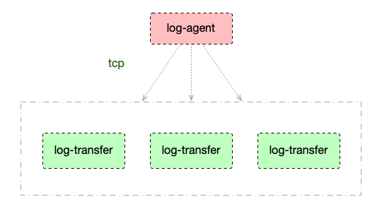

## 🧿 log-agent

log-agent项目是日志收集项目的client 端， 需要配合log-transfer server端进行使用。两者之间通过tcp 建立通信；进行数据发送。

## 🗒简介

+ log-agent 采用Java语言，log-transfer 采用golang语言。

+ 使用swagger `ApiOperation` 作为基础切入点，日志上报到异步事件监听。

+ log-agent事件监听通过netty channel 进行日志发送log-transfer  event-loop

+ log-agent 根据写入操作判断是否进行自动断连，默认情况60秒自动断开连接。

  



## 🧸使用

1. 在项目根目录进行mvn install打成jar 发布到本地仓库

   ```sh
   $ mvn install
   ```

2. Pom.xml引用log-agent,注意版本

   ````xml
   <dependency>
   	<groupId>com.log.agent</groupId>
   	<artifactId>log-agent</artifactId>
   	<version>1.0-SNAPSHOT</version>
   </dependency>
   ````

3. 设置配置信息，在spring-boot  项目的`yaml`或`properties`配置文件进行添加：

   ```yaml
   spring:
   	log-agent:
       enabled: true    //log-agent 启用状态，默认不启用
       url: localhost:9000 // log-transfer tcp地址 
   ```

4. 注意如果上面👆三步设置完成后启动报错为：`can not connect to log-transfer.`表示您设置的log-transfer tcp地址无法连接🚫

